如果你已经对`MVC`和前后端分离有所了解，那么可以跳过本节。如果你是新手，则需要了解一下程序设计架构。

## MVC
MVC（Model-View-Controller）是一种软件架构模式，它将应用程序分成三个主要部分：模型（Model）、视图（View）和控制器（Controller）



- Model（模型）：负责应用程序的数据和业务逻辑。直接管理数据、逻辑和规则。与数据库进行交互，处理数据的存储和检索。
- View（视图）：负责显示数据和用户界面。直接与用户交互，展示数据和接收用户输入。更新显示以反映模型的最新状态。
- Controller（控制器）：负责处理用户输入和请求。从视图接收输入并处理后，更新模型或视图。作为模型和视图之间的中介，协调它们的交互。

`GoFrame`也采用了类似`MVC`的模式，但又有所不同。需要说明的是，`MVC`只是一种设计思想，无需囿于此。

---

## 前端后端
对于一个 Web 程序而言，前端与后端是两个重要的组成部分。前端是指用户可以操作交互的页面，通常由`HTML`，`CSS`，`Javascript`构建，是软件程序的面子，也就是`MVC`中的`View`层，当然，如果你不了解他们也不影响我们学习`GoFrame`。

前端并不会提供任何数据，它只是一个展示数据的工具，数据的来源是后端。后端主要用作处理数据，是软件程序的里子，也就是`Controller`和`Model`层。

在很多年前，前后端并没有明确的分离，一般有后端编程语言直接输出`HTML`页面作为`View`层，但是这种方式不利于前后端的分工，也不利于项目的管理。后来随着前端技术的发展，前后端分离逐渐成为主流，前端也出现了很多框架，如`Vue`，`React`，`Angular`等，这些框架可以帮助我们更好的管理前端项目。

---

## Json与Xml
既然前后端分离了，就必须有一种统一的数据格式以便前后端之间的数据交互。目前主流的数据格式有`Json`和`Xml`。一个简单的`Json`数据如下，它记录了作者的个人信息：
```json
{
  "name": "oldme",
  "age": 18,
  "sex": "男",
  "address": "江苏省南京市", 
  "email": "tyyn1022@gmail.com",
  "website": "https://oldme.net",
  "wechat": "NobodyIsRight",
  "github": "https://github.com/oldme-git"
}
```
在后续的教学中，我们统一使用`Json`格式来进行数据交互，我们只需要我们开发的接口中能够返回正确的`Json`格式的数据即可。标准接口返回格式如下：
```json
{
  "code": 0,
  "message": "",
  "data": null
}
```
`code`为状态码，`0`代表成功，`message`为消息，`data`为接口中返回数据。