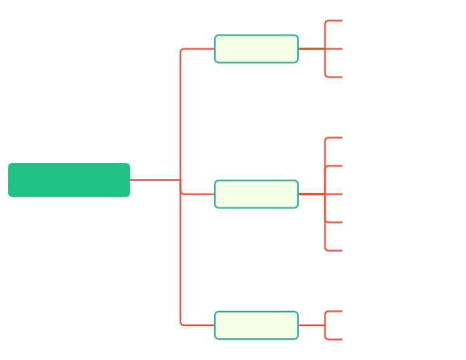

开发一个实际的项目前，一定要先了解项目的需求，这是后续开发的基础。根基不牢，地动山摇。

**星辰英语本**是一个帮助用户学习英语单词的轻量级软件，它会提供如下功能：
- 用户注册；
- 登录后管理自己的单词；
- 随机获取若干单词复习；
- 能设置单词的掌握度。

从功能点出发，我们可以做一个更直观的思维导图：


## 前后端分离
---
前文说过，本项目不会设计到任何前端开发，那么这里就有必要交代一下前端该如何处理。

对于一个 Web 程序而言，前端与后端是两个重要的组成部分。前端是指用户可以操作交互的页面，通常由`HTML`，`CSS`，`Javascript`构建，是软件程序的面子。前端并不会提供任何数据，它只是一个展示数据的工具，数据的来源是后端。后端提供所有的应用数据并且处理它们，是软件程序的里子。

很多年前，前后端并没有明确的界限，通常后端编程语言会直接输出`HTML`页面。随着互联网的发展，前端页面变得越来越复杂，这给后端程序员带来了很大的负担。于是，前后端分离逐渐成为主流，前端也出现了许多框架，如`Vue`、`React`、`Angular`等，这些框架可以帮助更好地管理前端项目。

**星辰英语本**的设计目的是为了让读者快速掌握`GoFrame`，所以也采取了前后端分离的模式，所有开发的内容都不直接输出`HTML`，而是绕过前端，直接输出标准的`Json`格式数据。

### Json
`Json`是当下最主流的前后端交互数据格式，一个标准接口返回的数据如下：
```json
{
    "code": 0,
    "message": "",
    "data": {
        "id": 1,
        "uid": 1,
        "word": "example",
        "definition": "A representative form or pattern.",
        "exampleSentence": "This is an example sentence.",
        "chineseTranslation": "例子",
        "pronunciation": "ɪɡˈzɑːmp(ə)l",
        "proficiencyLevel": 3,
        "createdAt": "2024-11-12 15:38:50",
        "updatedAt": "2024-11-13 14:42:19"
    }

}
```
`code`为状态码，`0`代表成功，`message`为自定义消息，`data`为响应数据。

当前端程序员通过`HTTP`请求拿到`Json`数据后，便可以在自己的领域大展身手，构建出具体的页面。